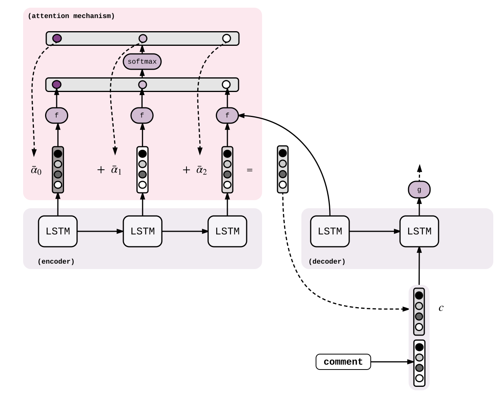

# Neural-Machine-Translation

## Running the models:

* Run `train_and_test.ipynb` to train and test all models
* To use them on command line, do:
    * `jupyter nbconvert --to=script train_and_test.ipynb`
    * `ipython train_and_test.py`
    
## Architecture Diagrams:

* seq2seq: [Sequence to Sequence Learning with Neural Networks](https://papers.nips.cc/paper/5346-sequence-to-sequence-learning-with-neural-networks.pdf)

* attention: [Neural Machine Translation By Jointly Learning To Align And Translate](https://arxiv.org/pdf/1409.0473.pdf)

* effective approaches: [Effective Approaches to Attention-based Neural Machine Translation](http://aclweb.org/anthology/D15-1166)

* coverage: [Modeling Coverage for Neural Machine Translation](http://www.aclweb.org/anthology/P16-1008)

## Results obtained on the sample dataset (english -> tamil):
**Click on the model name to download trained models**

| Model (Seq2Seq) | Bleu-Score | 
| -----------------------------------|------------|
| [Linguistic coverage](https://drive.google.com/open?id=1t9tsiP7qbtqT-dALfajofD-0n8paNjj7) | 0.089 | 
| [General attention](https://drive.google.com/file/d/1BuWvUZs_PQ7QkMa-R-wKmZiMqMR9J3bC/view?usp=sharing) | 0.087 |
| [Fertility coverage](https://drive.google.com/open?id=1Lyq0SE_CU5L8tDH8FCCV4P3KUvHpRr3W) | 0.0829 |
| [Vanilla](https://drive.google.com/open?id=1Sp-MU17TnG80okxhEFdXy52z5GuH7lzA) | 0.082 |
| [Concat attention](https://drive.google.com/open?id=1QgtTnIdxPacog7G4iGm-c6vug05m2GHg) | 0.0814 |
| [Dot attention](https://drive.google.com/open?id=1pAVeVE5SN2EK9IuZFsY9TYcDCIg7BJ9u) | 0.079 |
| [MLP attention](https://drive.google.com/open?id=1Sp-MU17TnG80okxhEFdXy52z5GuH7lzA) | 0.072 |
